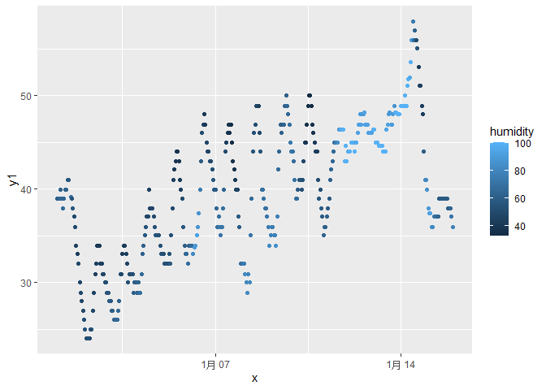

p8105_hw1_zl3386
================
Ziqiu Liu
2023-09-14

# Problem 1

## The `early_january_weather` dataset

The `early_january_weather` dataset contains hourly meterological data
for LGA, JFK and EWR for the month of January 2013. It is a subset of
the `weather` data frame from `nycflights13`.

- It has 15 variables, including `origin`(weather station), `year`,
  `month`, `day`, `hour`, `time_hour`(date and hour of the recording as
  a *POSIXct* date) and indicators of weather.
- It has 358 rows and 15 columns.
- The mean temperature is 39.5821229 °F.

## Scatterplot

Using the data from`early_january_weather`, we can make a scatterplot of
`temp` vs `time_hour`, using `humid` to determine the color of each
point.

<!-- -->

From the scatterplot, we can see that the temperature in the month of
January 2013 has fluctuations but goes up in general over time, and the
relative humidity is higher in late January.

We will save this scatterplot as a png file (`scatterplot.png`) in the
project directory.
